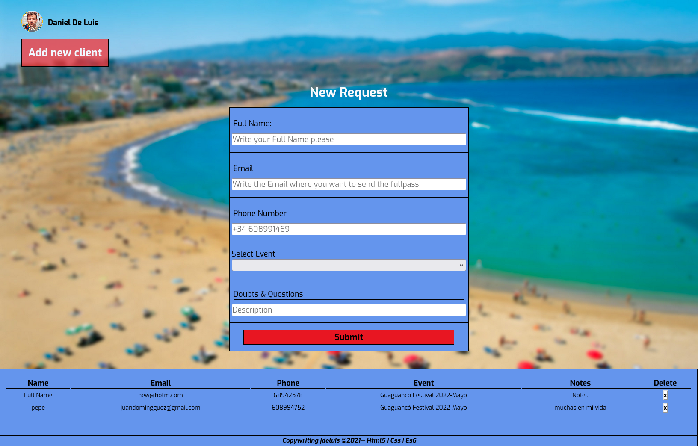

# app-web-registro-promotor
Aplicación para registrar todas las entradas de los festivales y sus comisiones como promotor.
//
App for register all my fullpasses of the festivals and commissions like a promoter.

*********************************
Technologies used so far: HTML|CSS|JS.     // Technologies used so far: HTML|CSS|JS.
*********************************

                                                        {{ ES }}  

Contenido Version Alpha:
 - Formulario que pida: Nombre, Email, Numero de telefono, seleccion del evento, y un texarea con notas adicionales.
 - Una tabla donde se refleje los datos introducidos en el formulario.
 - Eliminacion de una de las filas de la tabla si se requiere.
 - Guardar informacion de la tabla y ejecutar una vez vuelto a iniciar el programa.
 - Estilos CSS
 - SEO básico.
 - Informacion del promotor.
 - Footer con Copyright.

Implementaciones a la Version Betha:   
 -Posibilidad de añadir otros promotores al programa no solo el mio.  
 -Descarga de las tablas a pdf y o exel. 
 -Posibilidad de envio de tablas por correo en formato pdf o excel.  
 -Admin de la app:   
 ------------------------Metodos: Añadir y eliminar promotores 
 ------------------------Modificar clientes de promotores (cambios visibles) 
 
                                                        {{ EN }}  

Alpha version content:
 - Request form: Name, Email, Telephone number, selection of the event, and a text with additional notes.
 - A table where the data entered in the form is reflected.
 - Elimination of one of the rows of the table if required.
 - Save table information and run once the program is started again.
 - CSS styles
 - Basic SEO.
 - Promoter information.
 - Footer with Copyright.
 
 
Implementations to Version Betha:  
 -Possibility of adding other promoters to the program, not just mine.  
 -Download tables to pdf and or excel. 
 -Possibility of sending tables by mail in pdf or excel format.  
 -App admin:  
 ------------------------Methods: Add and remove promoters 
 ------------------------Modify clients of promoters (visible changes) 
 
 ****************************************

 
 
 
